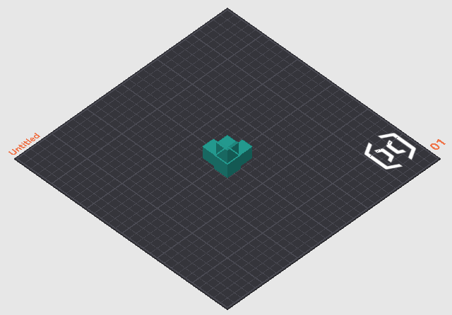
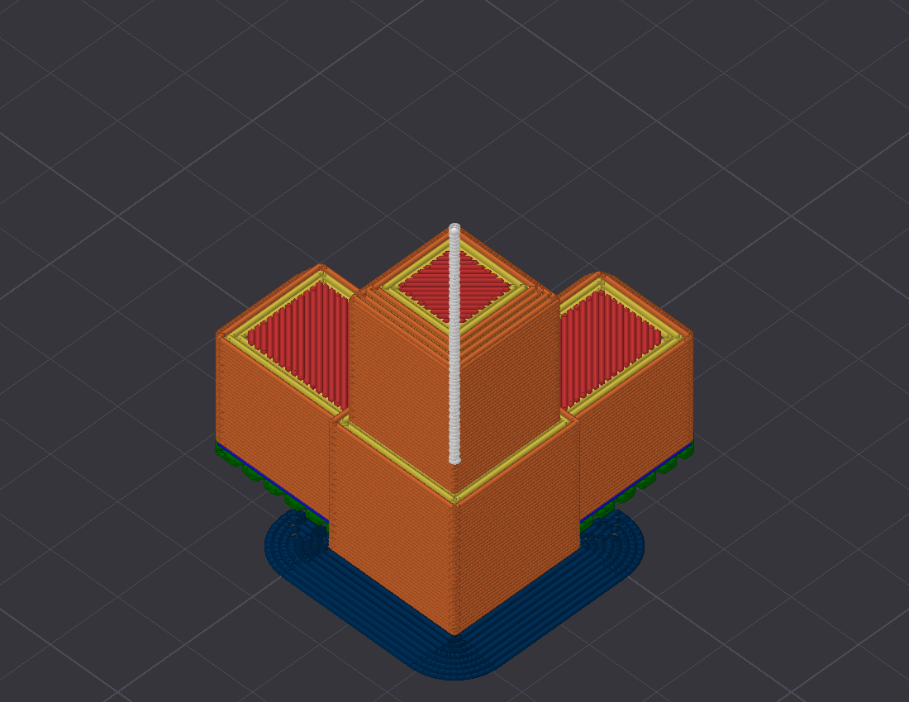

# OrcaSlicer MCP

[](https://pypi.org/project/orcaslicer-mcp/)
[](https://pypi.org/project/orcaslicer-mcp/)
[](LICENSE)
[](https://lobehub.com/mcp/maxellis-orcaslicer-mcp)

Let Claude drive a real, running OrcaSlicer. It loads models, arranges the plate, tunes settings, slices, and reads the result back. Every change lands in the GUI while you watch.

This package is an [MCP](https://modelcontextprotocol.io) server: it bundles no model and talks to nothing but OrcaSlicer, at an address you configure, localhost by default. The model comes from your MCP client. If that client uses a hosted one, your conversation goes there as any chat does; your models, profiles, and gcode stay on the machine running the slicer. Point the client at a local model and nothing leaves at all.

## What it can do

### Settings

Read and write any of roughly 800 OrcaSlicer settings on the live config, for the whole plate or scoped narrower: `get_config`, `set_config`, `find_config_keys`, `set_layer_height`, `set_height_range` for a band of layers, and `set_object_config` for one object's overrides.

### Knowing what the settings mean

An offline settings reference ships with the package, carrying the authoritative label, tooltip, type, range, enum, and default for each key, so `describe_setting`, `search_settings`, and `compare_settings` answer from OrcaSlicer's own source instead of guessing. `consult` composes curated slicing knowledge and your saved notes by topic, symptom, or goal.

`check_profile_physics` is a deterministic gate. It overlays proposed changes on the live config, runs flow, temperature, geometry, and cooling math, then returns `ok`, `warnings`, or `blocked`. Accelerations your printer cannot reach and speeds past the flow ceiling get caught before they reach a print.

### Presets

`list_presets`, `select_preset`, `get_preset_config`, `edit_preset`, `save_preset`, `rename_preset`, `delete_preset`.

### Slicing, and reading the result back

`slice`, `slice_and_wait`, `apply_and_slice`, `cancel_slice`, `get_slice_status`, `get_slice_warnings`, `get_gcode`.

`get_slice_breakdown` returns per-feature time, filament, and flow. OrcaSlicer shows the same information in the legend beside its preview, sized for a screen; this returns it as numbers an assistant can compare and act on:

```
role                    time      share   filament   mean flow
inner_wall              5m 41s    30.8%     6.43 g    16.0 mm3/s
outer_wall              3m 19s    18.0%     3.20 g    13.6 mm3/s
sparse_infill           3m 07s    17.0%     3.57 g    17.0 mm3/s
internal_solid_infill   2m 01s    11.0%     1.72 g    11.8 mm3/s
bridge                     52s     4.7%     0.26 g     4.4 mm3/s
support_interface          36s     3.2%     0.52 g    12.3 mm3/s
overhang_perimeter         28s     2.5%     0.13 g     3.7 mm3/s
internal_bridge            21s     1.9%     0.45 g    19.9 mm3/s
top_surface                19s     1.7%     0.29 g    12.5 mm3/s
brim                       12s     1.1%     0.21 g    14.7 mm3/s
bottom_surface              7s     0.7%     0.10 g    11.8 mm3/s
                        18m 24s            16.89 g
```

It answers which feature is eating the time without slicing repeatedly to find out. A `prediction_check` rides along and flags any role where the profile's requested speed got throttled at the flow ceiling.

### Models and the plate

`load_model` (`.stl`, `.obj`, `.3mf`, plus `.step` and `.stp` on fork v2.3.2-mcp.3 and later), `list_objects` with each object's world-space bounding box and an `on_plate` flag, `transform_object`, `duplicate_object`, `delete_object`, `arrange_plate`, `auto_orient`, `check_placement`, `diagnose_plate`, `get_job_status`.

### Plate renders

`render_plate` hands back a PNG, so the assistant can look instead of inferring from coordinates. A rotation reads instantly as a picture and barely at all as three Euler angles. Seven camera angles cover `iso`, `top`, `front`, `left`, `right`, `rear`, and `bottom`. Use `frame="plate"` to stand back for the whole bed, or `frame="object"` to lean in on the part. Requires fork v2.3.2-mcp.4 or later.

| `view="editor"` | `view="preview"` |
|---|---|
|  |  |
| Your models on the bed. Answers orientation, plate contact, and first-layer footprint. | Sliced toolpaths coloured by feature role, so support placement is plain to see. |

### Live state and memory

`get_status` and `watch_events` report what the slicer is doing now. `remember` persists machine, user, and project facts for later sessions, as plain local files in `~/.orcaslicer-mcp/notes/`, relocatable with `ORCA_MCP_NOTES_DIR`.

## What you need

Stock OrcaSlicer ships without a control API, so a matching build does that half of the job.

1. **The OrcaSlicer MCP build.** OrcaSlicer 2.3.2 with an embedded local API, token-authenticated and bound to localhost until you say otherwise. Get it from the [releases page](https://github.com/maxellis/OrcaSlicer/releases). If no binary is up for your platform yet, build the `remote-api` branch from source.
2. **This package (`orcaslicer-mcp`).** The MCP server that connects your AI client to that build.

> **Updating:** take new builds from the [releases page](https://github.com/maxellis/OrcaSlicer/releases), never from inside the app. The in-app updater offers *stock* OrcaSlicer, which drops the control API. Builds mcp.2 and later turn that updater off for you. On an older build, click **Skip this Version** if a "new version available" prompt appears.

## Quickstart

Install [uv](https://docs.astral.sh/uv/getting-started/installation/) first, because it provides the `uvx` command that runs the server. One line does it: `curl -LsSf https://astral.sh/uv/install.sh | sh` on macOS and Linux, or `irm https://astral.sh/uv/install.ps1 | iex` in PowerShell on Windows.

1. Install the OrcaSlicer MCP build, launch it, and finish the one-time setup by picking your printer. A fresh install may show a **“Bambu Network Plug-in Required”** dialog. Click **Skip for Now**, since that plug-in only serves Bambu cloud printing. The control API starts once setup is finished.
2. Open **Preferences** (Ctrl+P), go to **Remote API**, and tick **Enable Remote API**. Copy the token shown on that page. Access stays localhost-only unless you also switch on "Allow LAN access".
3. Connect your MCP client.

    **Claude Desktop:** download `orcaslicer-mcp-<version>.mcpb` from the [releases page](https://github.com/maxellis/orcaslicer-mcp/releases/latest) and open the file. Claude Desktop offers to install it. Open the extension's settings afterwards, paste the token from step 2, and enable it.

    > Ignore any guide that tells you to hand-edit `claude_desktop_config.json`. Current Claude Desktop builds rewrite that file themselves and drop added `mcpServers` entries, so the edit will not stick. The extension leaves the file alone and finds `uvx` by itself.

    **Claude Code and other MCP clients:** add the server to your client's MCP config. For Claude Code that means a project `.mcp.json`:

    ```json
    {
      "mcpServers": {
        "orcaslicer": {
          "command": "uvx",
          "args": ["orcaslicer-mcp"],
          "env": {
            "ORCA_API_TOKEN": "<token from Preferences>"
          }
        }
      }
    }
    ```

    `ORCA_API_URL` defaults to `http://127.0.0.1:13130`. Set it only if you changed the port, or if OrcaSlicer runs on another machine with LAN access enabled there.

    > **macOS note for GUI clients other than Claude Desktop:** apps launched from the Dock do not inherit your terminal's PATH, so `"command": "uvx"` can fail silently. Run `which uvx` in Terminal, then paste the full path it prints into `"command"`. It is usually `~/.local/bin/uvx`.

4. Restart your client and ask: *"Load benchy.stl, slice it with the current profile, and tell me the print time."*

## Security

- The control API binds **127.0.0.1 only** by default. LAN access is an explicit opt-in in Preferences.
- Every request must carry the API token. OrcaSlicer generates it on first run and can regenerate it at any time.
- The MCP server runs as a local stdio process and opens no connection except to OrcaSlicer. No telemetry.

## Development

```bash
uv venv && uv pip install -e ".[dev]"
uv run pytest   # unit tests against a mock API, plus a guarded live smoke test
```

The live smoke test skips itself unless `ORCA_API_URL` and `ORCA_API_TOKEN` point at a running OrcaSlicer MCP build.

Protocol notes, design specs, and verification results live in [`docs/`](docs/).

## Privacy policy

The server talks to OrcaSlicer's local API at the address you configure, localhost by default, and to nothing else. It has no backend, so there is no service of ours for anything to reach. What leaves your machine is whatever your MCP client sends its model: the conversation, plus any settings or file contents you or the assistant put into it. Their terms govern that traffic, and it is the same traffic any other use of that client produces. A local model removes it entirely.

- **Data collection:** none. The server collects nothing about you or your usage.
- **Usage and storage:** models, settings, and gcode stay on the computer running OrcaSlicer, held in memory only for the duration of each request. The API token authenticates the server to OrcaSlicer, and your MCP client stores it. Claude Desktop keeps extension settings in the operating system's credential store.
- **Third-party sharing:** none by this server, which has no analytics and no backend. Traffic between your client and its model provider sits outside this project and falls under their policies.
- **Data retention:** the only data written to disk is notes you save yourself with `remember`, stored as plain files under `~/.orcaslicer-mcp/notes/`. Read or delete them whenever you like. Delete the folder and nothing remains.
- **Contact:** questions and concerns go in [an issue](https://github.com/MaxEllis/orcaslicer-mcp/issues).

## Status

Early public release, soft launch. The server carries 183 unit tests and gets exercised on real print jobs. Prebuilt OrcaSlicer MCP builds cover Windows, macOS, and Linux on the [releases page](https://github.com/maxellis/OrcaSlicer/releases). Issues and reports are welcome.

## License

AGPL-3.0, matching OrcaSlicer, from whose source the bundled settings schema derives. See [LICENSE](LICENSE).

<!-- mcp-name: io.github.MaxEllis/orcaslicer-mcp -->
