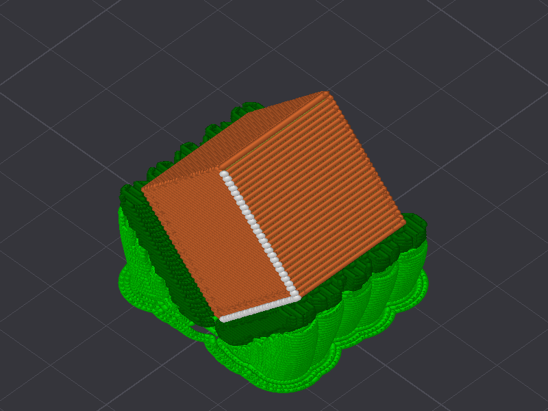
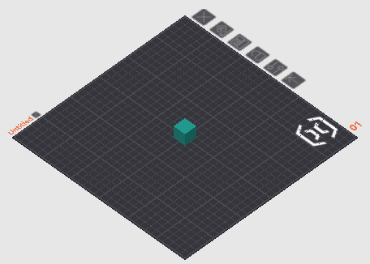

# OrcaSlicer MCP

[](https://pypi.org/project/orcaslicer-mcp/)
[](https://pypi.org/project/orcaslicer-mcp/)
[](LICENSE)

Let Claude drive a real, running OrcaSlicer. It loads models, arranges the plate, tunes settings, slices, and reads the result back. Every change lands in the GUI while you watch.



*What the assistant sees after a slice: support in green, its interface in white, top surfaces in orange.*

The slicer stays in charge and stays on your machine. This package is an [MCP](https://modelcontextprotocol.io) server, so it holds no model of its own and makes no cloud calls. It talks to OrcaSlicer at an address you configure, which is localhost by default.

## What you need

Stock OrcaSlicer ships without a control API, so a matching build does that half of the job.

1. **The OrcaSlicer MCP build.** OrcaSlicer 2.3.2 with an embedded local API, token-authenticated and bound to localhost until you say otherwise. Get it from the [releases page](https://github.com/maxellis/OrcaSlicer/releases). If no binary is up for your platform yet, build the `remote-api` branch from source.
2. **This package (`orcaslicer-mcp`).** The MCP server that connects your AI client to that build.

> **Updating:** take new builds from the [releases page](https://github.com/maxellis/OrcaSlicer/releases), never from inside the app. The in-app updater offers *stock* OrcaSlicer, which drops the control API. Builds mcp.2 and later turn that updater off for you. On an older build, click **Skip this Version** if a "new version available" prompt appears.

## Quickstart

Install [uv](https://docs.astral.sh/uv/getting-started/installation/) first, because it provides the `uvx` command that runs the server. One line does it: `curl -LsSf https://astral.sh/uv/install.sh | sh` on macOS and Linux, or `irm https://astral.sh/uv/install.ps1 | iex` in PowerShell on Windows.

1. Install the OrcaSlicer MCP build, launch it, and finish the one-time setup by picking your printer. A fresh install may show a **“Bambu Network Plug-in Required”** dialog. Click **Skip for Now**, since that plug-in only serves Bambu cloud printing. The control API starts once setup is finished.
2. Open **Preferences** (Ctrl+P), go to **Remote API**, and tick **Enable Remote API**. Copy the token shown on that page. Access stays localhost-only unless you also switch on "Allow LAN access".
3. Connect your MCP client.

    **Claude Desktop:** download `orcaslicer-mcp-<version>.mcpb` from the [releases page](https://github.com/maxellis/orcaslicer-mcp/releases/latest) and open the file. Claude Desktop offers to install it. Open the extension's settings afterwards, paste the token from step 2, and enable it.

    > Ignore any guide that tells you to hand-edit `claude_desktop_config.json`. Current Claude Desktop builds rewrite that file themselves and drop added `mcpServers` entries, so the edit will not stick. The extension leaves the file alone and finds `uvx` by itself.

    **Claude Code and other MCP clients:** add the server to your client's MCP config. For Claude Code that means a project `.mcp.json`:

    ```json
    {
      "mcpServers": {
        "orcaslicer": {
          "command": "uvx",
          "args": ["orcaslicer-mcp"],
          "env": {
            "ORCA_API_TOKEN": "<token from Preferences>"
          }
        }
      }
    }
    ```

    `ORCA_API_URL` defaults to `http://127.0.0.1:13130`. Set it only if you changed the port, or if OrcaSlicer runs on another machine with LAN access enabled there.

    > **macOS note for GUI clients other than Claude Desktop:** apps launched from the Dock do not inherit your terminal's PATH, so `"command": "uvx"` can fail silently. Run `which uvx` in Terminal, then paste the full path it prints into `"command"`. It is usually `~/.local/bin/uvx`.

4. Restart your client and ask: *"Load benchy.stl, slice it with the current profile, and tell me the print time."*

## What the assistant can do

- **Plate and models:** `load_model` (`.stl`, `.obj`, `.3mf`, plus `.step` and `.stp` on fork v2.3.2-mcp.3+), `list_objects`, `transform_object`, `duplicate_object`, `delete_object`, `arrange_plate`, `auto_orient`, `check_placement`, `diagnose_plate`, `get_job_status`
- **Settings:** `get_config`, `set_config`, `find_config_keys`, `describe_setting`, `search_settings`, `compare_settings`, `set_layer_height`, `set_height_range`, `set_object_config` for per-object overrides
- **Presets:** `list_presets`, `select_preset`, `get_preset_config`, `edit_preset`, `save_preset`, `rename_preset`, `delete_preset`
- **Slicing:** `slice`, `slice_and_wait`, `apply_and_slice`, `cancel_slice`, `get_slice_status`, `get_slice_warnings`, `get_slice_breakdown` for per-feature time and flow analysis, `get_gcode`
- **Live state:** `get_status`, `watch_events`

## Seeing the plate

`render_plate` hands back a real PNG, so the assistant looks instead of inferring from coordinates. A rotation reads instantly as a picture and barely at all as three Euler angles.

| `view="editor"` | `view="preview"` |
|---|---|
|  |  |
| Your models on the bed. Answers orientation, plate contact, and first-layer footprint. | Sliced toolpaths coloured by feature role, so support placement is plain to see. |

Seven camera angles cover `iso`, `top`, `front`, `left`, `right`, `rear`, and `bottom`. Use `frame="plate"` to stand back for the whole bed, or `frame="object"` to lean in on the part. Requires fork v2.3.2-mcp.4 or later.

`list_objects` reports the matching numbers, including each object's world-space bounding box and an `on_plate` flag.

## Settings intelligence

- **`consult(query)`** composes curated slicing knowledge and your saved notes per topic, symptom, or goal.
- **`check_profile_physics(changes?)`** is a deterministic sanity gate. It overlays proposed changes on the live config, runs flow, temperature, geometry, and cooling math, then returns `ok`, `warnings`, or `blocked`.
- **`remember(note, scope)`** persists machine, user, and project facts for later sessions. They are plain local files in `~/.orcaslicer-mcp/notes/`, relocatable with `ORCA_MCP_NOTES_DIR`.

An offline settings reference ships with the package: authoritative label, tooltip, type, range, enum, and default for roughly 800 OrcaSlicer settings.

## Security

- The control API binds **127.0.0.1 only** by default. LAN access is an explicit opt-in in Preferences.
- Every request must carry the API token. OrcaSlicer generates it on first run and can regenerate it at any time.
- The MCP server runs as a local stdio process. No telemetry, no cloud.

## Development

```bash
uv venv && uv pip install -e ".[dev]"
uv run pytest   # unit tests against a mock API, plus a guarded live smoke test
```

The live smoke test skips itself unless `ORCA_API_URL` and `ORCA_API_TOKEN` point at a running OrcaSlicer MCP build.

Protocol notes, design specs, and verification results live in [`docs/`](docs/).

## Privacy policy

Everything runs on your own machines. The server talks to OrcaSlicer's local API at the address you configure, localhost by default, and to nothing else. No telemetry, no analytics, no accounts, no cloud calls.

- **Data collection:** none. The server collects nothing about you or your usage.
- **Usage and storage:** models, settings, and gcode stay on your computer, held in memory only for the duration of each request. The API token authenticates the server to OrcaSlicer, and your MCP client stores it. Claude Desktop keeps extension settings in the operating system's credential store.
- **Third-party sharing:** none. Nothing goes to us or to any third party, and there is no server-side "us" to send it to.
- **Data retention:** the only data written to disk is notes you save yourself with `remember`, stored as plain files under `~/.orcaslicer-mcp/notes/`. Read or delete them whenever you like. Delete the folder and nothing remains.
- **Contact:** questions and concerns go in [an issue](https://github.com/MaxEllis/orcaslicer-mcp/issues).

## Status

Early public release, soft launch. The server carries 183 unit tests and gets exercised on real print jobs. Prebuilt OrcaSlicer MCP builds cover Windows, macOS, and Linux on the [releases page](https://github.com/maxellis/OrcaSlicer/releases). Issues and reports are welcome.

## License

AGPL-3.0, matching OrcaSlicer, from whose source the bundled settings schema derives. See [LICENSE](LICENSE).

<!-- mcp-name: io.github.MaxEllis/orcaslicer-mcp -->
